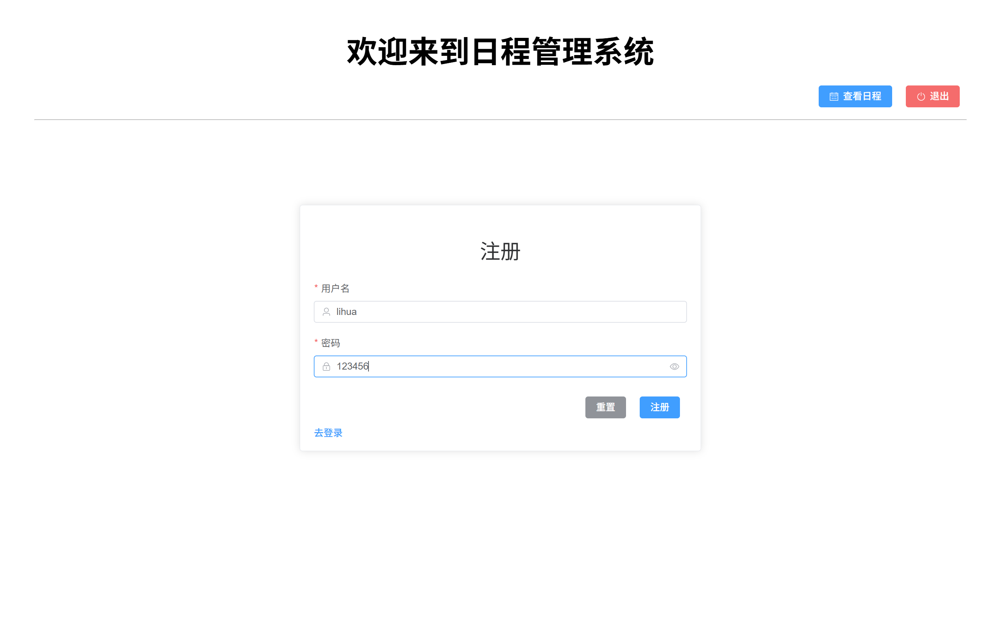
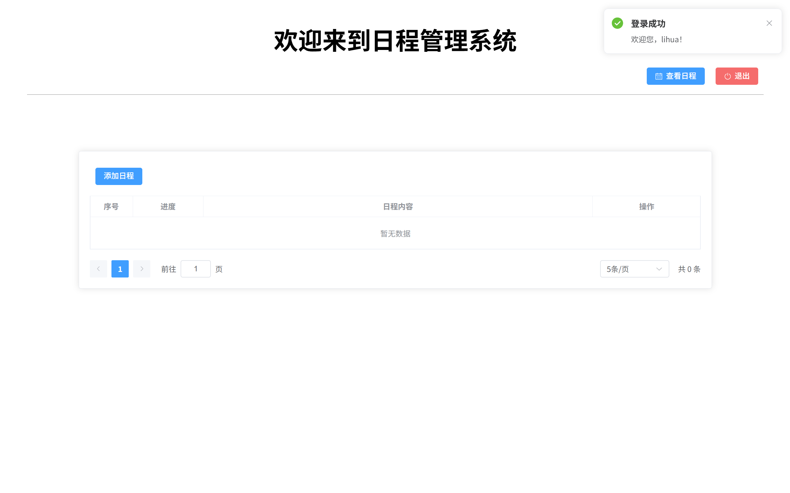
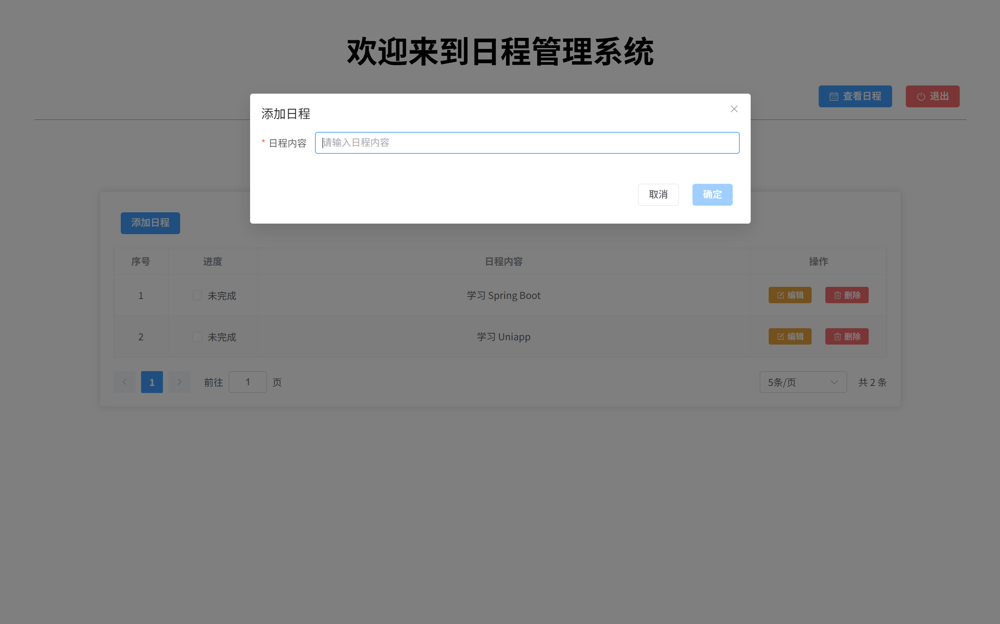
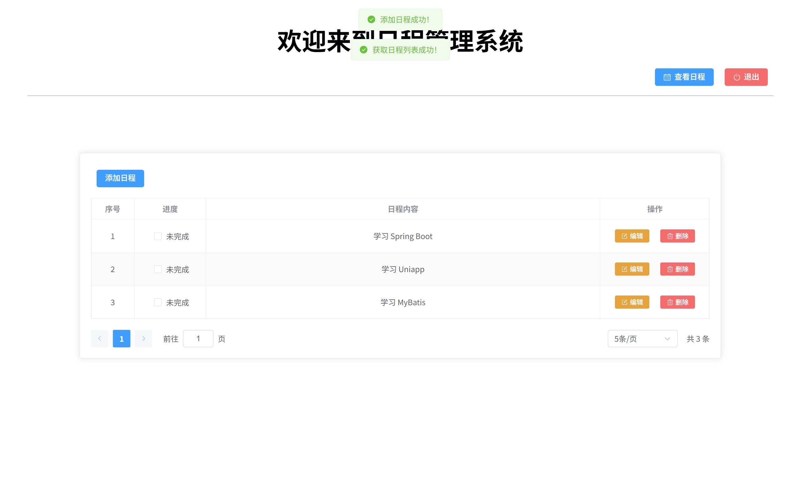

# 📅 日程管理系统 (Schedule Management System)

>   实际只是非常简单/简短/简洁的一个用来学习基础`JavaWeb`（`Tomcat`、`Servlet`）的一个练手训练场。
>
>   **纯学习、练手的项目。甚至没用maven等。\_(:з)∠)_**

一个基于 **Vue3 + Java Servlet + MySQL** 的全栈日程管理系统，支持用户注册登录、日程的增删改查、分页查询等功能。


## 🎯 项目特点

- 🎨 **现代化前端**：Vue3 + TypeScript + Element Plus + Pinia
- 🔧 **经典后端**：Java Servlet + JDBC + Druid 连接池
- 🔐 **JWT 认证**：基于 Token 的用户认证机制
- 📊 **分页查询**：支持大数据量的分页展示
- 🎭 **统一响应**：标准化的 JSON 响应格式
- 🛡️ **错误处理**：完善的业务状态码体系


## 📦 项目结构

```
schedule-system/
├── backend/                 # 后端 Java Servlet 项目
│   ├── src/                 # Java 源码
│   ├── resources/           # 配置文件
│   └── web/                 # Web 资源
├── frontend/                # 前端 Vue3 项目
│   ├── src/                 # 源码
│   ├── public/              # 静态资源
│   └── package.json         # 依赖配置
├── logs/                    # 日志目录
└── README.md                # 项目说明
```


## 🚀 快速开始

#### 0. 环境要求

- **前端**：`Node.js` >= 18.x, 使用 `pnpm` 包管理器
- **后端**：`JDK` >= 17, `Tomcat` >= 10.x
- **数据库**：`MySQL` >= 8.0

#### 1. 克隆项目

```bash
git clone https://github.com/sanjuu2024/schedule-system.git
cd schedule-system
```

#### 2. 数据库初始化

```sql
SET NAMES utf8mb4;
SET FOREIGN_KEY_CHECKS = 0;

create database if not exists schedule_system;
use schedule_system;
-- ----------------------------
-- 创建日程表
-- ----------------------------
DROP TABLE IF EXISTS `sys_schedule`;
CREATE TABLE `sys_schedule`  (
  `sid` int NOT NULL AUTO_INCREMENT,
  `uid` int NULL DEFAULT NULL,
  `title` varchar(20) CHARACTER SET utf8mb4 COLLATE utf8mb4_0900_ai_ci NULL DEFAULT NULL,
  `completed` int(1) NULL DEFAULT NULL,
  PRIMARY KEY (`sid`) USING BTREE
) ENGINE = InnoDB AUTO_INCREMENT = 1 CHARACTER SET = utf8mb4 COLLATE = utf8mb4_0900_ai_ci ROW_FORMAT = Dynamic;

-- ----------------------------
-- 创建用户表
-- ----------------------------
DROP TABLE IF EXISTS `sys_user`;
CREATE TABLE `sys_user`  (
  `uid` int NOT NULL AUTO_INCREMENT,
  `username` varchar(10) CHARACTER SET utf8mb4 COLLATE utf8mb4_0900_ai_ci NULL DEFAULT NULL,
  `user_pwd` varchar(100) CHARACTER SET utf8mb4 COLLATE utf8mb4_0900_ai_ci NULL DEFAULT NULL,
  PRIMARY KEY (`uid`) USING BTREE,
  UNIQUE INDEX `username`(`username`) USING BTREE
) ENGINE = InnoDB CHARACTER SET = utf8mb4 COLLATE = utf8mb4_0900_ai_ci ROW_FORMAT = Dynamic;

-- ----------------------------
-- 插入用户数据
-- ----------------------------
INSERT INTO `sys_user` VALUES (1, 'zhangsan', 'e10adc3949ba59abbe56e057f20f883e');   # 实际明文密码是123456，数据库存入的是MD5加密过的密码
INSERT INTO `sys_user` VALUES (2, 'lisi', 'e10adc3949ba59abbe56e057f20f883e');

SET FOREIGN_KEY_CHECKS = 1;
```

#### 3. 后端配置

修改 `backend/resources/db.properties`：

```properties
url=jdbc:mysql://{your_database_ip}:{your_database_port}/schedule_system
username=your_username
password=your_password
```

详见 [后端 README](./backend/README.md)

#### 4. 前端启动

```bash
cd frontend
pnpm install
pnpm run dev
```

详见 [前端 README](./frontend/README.md)


## 🔧 核心功能

### 用户模块
- ✅ 用户注册（用户名唯一性校验）
- ✅ 用户登录（JWT Token 认证）
- ✅ 用户退出（Token 失效）
- ✅ 用户信息获取

### 日程模块
- ✅ 日程列表查询（分页）
- ✅ 添加日程
- ✅ 编辑日程
- ✅ 删除日程
- ✅ 切换完成状态


## 🛠️ 技术栈

### 前端技术

| 技术 | 版本 | 说明 |
|------|------|------|
| Vue | 3.5.x | 渐进式 JavaScript 框架 |
| TypeScript | 5.x | JavaScript 的超集 |
| Element Plus | 2.11.x | Vue3 UI 组件库 |
| Pinia | 3.x | Vue 状态管理库 |
| Vue Router | 4.x | 官方路由管理器 |
| Axios | 1.x | HTTP 请求库 |
| Vite | 6.x | 下一代前端构建工具 |

### 后端技术

| 技术 | 说明 |
|------|------|
| Java Servlet | Web 应用核心 |
| JDBC | 数据库访问 |
| Druid | 数据库连接池 |
| Jackson | JSON 处理 |
| JWT | Token 认证 |
| Lombok | 简化 Java 代码 |
| Logback | 日志框架 |


## 📖 API 文档

### 用户接口

| 接口 | 方法 | 说明 |
|------|------|------|
| `/v1/user/register` | POST | 用户注册 |
| `/v1/user/login` | POST | 用户登录 |
| `/v1/user/logout` | POST | 用户退出 |
| `/v1/user/info` | GET | 获取用户信息 |

### 日程接口

| 接口 | 方法 | 说明 |
|------|------|------|
| `/v1/schedule/list/{page}/{size}` | GET | 分页查询日程 |
| `/v1/schedule/add` | POST | 添加日程 |
| `/v1/schedule/update` | PUT | 更新日程 |
| `/v1/schedule/delete/{id}` | DELETE | 删除日程 |


## 🎨 项目截图

-   注册页面



-   日程管理页面 



-   添加日程



-   退出登录重定向到登录界面




## 📝 开发规范

- **Git Commit**: 遵循 [Conventional Commits](https://www.conventionalcommits.org/)
- **代码风格**: ESLint + Prettier (前端) / Google Java Style (后端)
